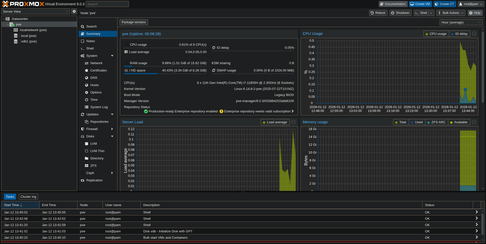
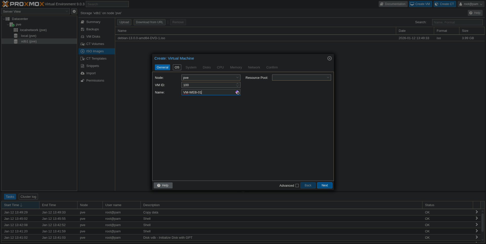
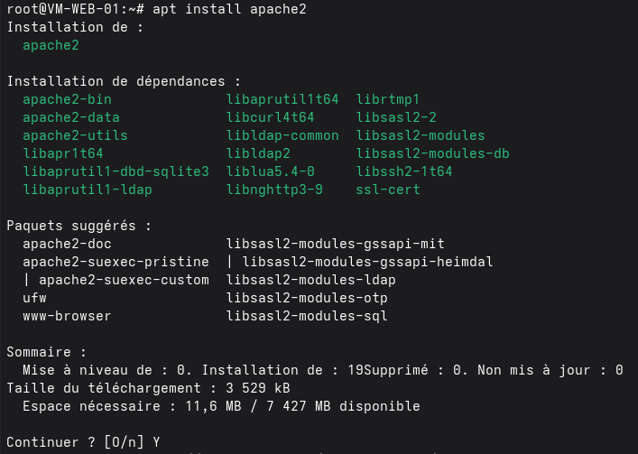
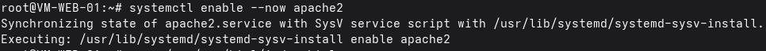
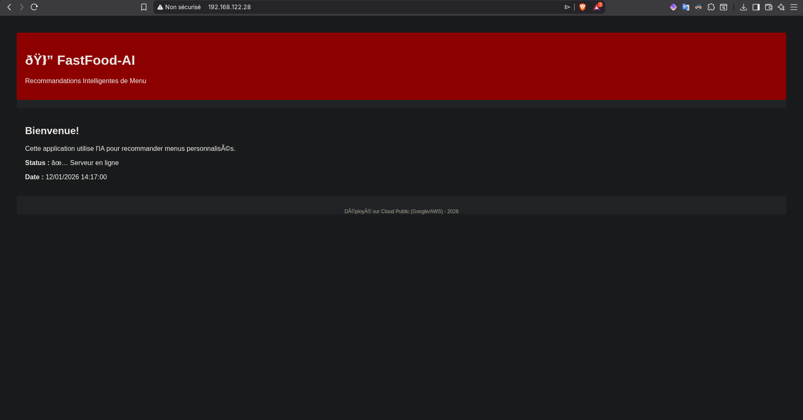
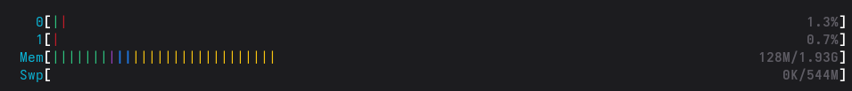

# Rapport de compte rendu TP2 - Consultant Junior 

Ce TP nous a permis d'explorer deux approches de déploiement d'infrastructure : le cloud public avec Microsoft Azure et le cloud privé avec Proxmox. L'objectif était de comparer ces solutions en conditions réelles.

## Section 1 : Déploiement Cloud Public Microsoft Azure

#### Architecture déployée sur Azure

Création d'une instance Ubuntu avec 8Go de RAM, bridgé et 2 VCPUs.

On peut y voir les ressources allouées à la VM, la configuration réseau, les différentes sections de configuration de la VM (ACLs)


#### Première connexion SSH 

Il est nécessaire d'ajouter la clé SSH privé de la VM avec la commande pour pouvoir s'y connecter directement et plus facilement :

```bash
sudo chmod 600 myVm-maurer_key.pem && ssh-add myVm-maurer_key.pem
```

Après avoir déployé l'instance Azure et ajouté la clé publique nous nous connectons avec la commande.

```bash 
ssh azureuser@<ip-public> # -i si on veut utiliser la clé privé directement
```


#### Installation d'Apache2

Nous installons le serveur web Apache2, nous activons le service au démarrage de la VM et nous le démarrons.


Nous voyons que le service est correctement configuré et ne présente aucun défaut de configuration.

#### Règles de sécurité réseau

Dans Azure, la gestion du trafic réseau se fait à l'aide de groupes de sécurité réseau (NSG) qui permettent de définir des règles entrantes (inbound) et sortantes (outbound). 

- **Règles entrantes (Inbound)** : contrôlent le trafic provenant de l'extérieur vers la VM.
- **Règles sortantes (Outbound)** : contrôlent le trafic émis par la VM vers l'extérieur.

Voici un tableau récapitulatif des règles configurées :

| Sens      | Protocole | Port(s)      | Source/Destination | Description                        |
|-----------|-----------|--------------|--------------------|------------------------------------|
| Entrant   | TCP       | 22           | Any                | SSH (accès à distance)             |
| Entrant   | TCP       | 80           | Any                | HTTP (serveur web)                 |
| Entrant   | TCP       | 443          | Any                | HTTPS (serveur web sécurisé)       |
| Entrant   | UDP/TCP   | 53           | Any                | DNS (résolution de noms)           |
| Entrant   | ICMP      | Any          | Any                | ICMP (ping, diagnostic réseau)     |
| Sortant   | TCP       | 80           | Any                | HTTP (accès web sortant)           |
| Sortant   | TCP       | 443          | Any                | HTTPS (accès web sécurisé sortant) |
| Sortant   | UDP/TCP   | 53           | Any                | DNS (résolution de noms sortante)  |

**Différence entre inbound et outbound :**

- Les règles **inbound** protègent la VM contre les accès non autorisés depuis Internet ou d'autres réseaux, en ne laissant passer que les ports/services nécessaires.
- Les règles **outbound** limitent les connexions que la VM peut initier vers l'extérieur, ce qui permet de contrôler et sécuriser les flux sortants (par exemple, empêcher la VM de communiquer avec des sites non approuvés).

Cette séparation permet de renforcer la sécurité en ne laissant passer que le trafic strictement nécessaire, aussi bien en entrée qu'en sortie.


#### Configuration du nom de domaine

J'ai créé un sous-domaine sur DuckDNS.org (api-maurer.duckdns.org) pointant vers mon IP publique 40.66.42.255. La propagation DNS a pris environ 2 minutes.


Nous voyons bien que le sous-domaine pointe vers l'IP publique de la VM Azure.

#### Mise en place du certificat SSL

Le réseau de l'IUT bloque les connexions HTTP vers des IP publiques. J'ai donc généré un certificat SSL auto-signé pour passer en HTTPS.


Mise en place des certificats sur la VM Azure :


Configuration Apache pour SSL :

```bash
sudo nano /etc/apache2/sites-available/api-maurer-ssl.conf
```

```bash
<VirtualHost *:443>
    ServerName api-maurer.duckdns.org
    DocumentRoot /var/www/html

    SSLEngine on
    SSLCertificateFile /etc/ssl/certs/api-maurer.crt
    SSLCertificateKeyFile /etc/ssl/private/api-maurer.key

    <Directory /var/www/html>
        Options Indexes FollowSymLinks
        AllowOverride All
        Require all granted
    </Directory>

    ErrorLog ${APACHE_LOG_DIR}/ssl_error.log
    CustomLog ${APACHE_LOG_DIR}/ssl_access.log combined
</VirtualHost>
```

Activation des modules SSL et du site sur apache2 :

```bash
sudo a2enmod ssl
sudo a2ensite api-maurer-ssl
```


#### Vérifications et tests d'accès

Pour valider la configuration, plusieurs vérifications ont été réalisées :

- **Test CURL en HTTPS** : Un test avec `curl` a permis de vérifier l’accessibilité du site en HTTPS, confirmant la bonne installation du certificat SSL.

    

- **Accès externe** : Un accès depuis un poste extérieur a été effectué pour s’assurer que le site est bien accessible publiquement.

    

- **Temps de réponse** : Les mesures montrent des temps de réponse relativement longs, principalement dus aux ressources limitées de la VM et à l’utilisation d’un certificat auto-signé.

    

- **Logs Apache** : L’analyse des logs HTTP confirme la réception correcte des requêtes et l’absence d’erreurs.

    

Ces vérifications attestent du bon fonctionnement du service web déployé sur Azure, malgré quelques limitations de performance liées à la configuration matérielle.

## Section 2 : Déploiement On-premise avec Proxmox

J'ai installé Proxmox 9.0 sur une machine disposant de 16 Go de RAM et 8 vCPU. Le disque système fait 10 Go et celui pour les VMs 100 Go.

Étapes réalisées : upload de l'ISO Debian, création de la VM, connexion SSH, passage root, nettoyage du sources.list, mise à jour des paquets, installation et activation d'Apache2. L'ensemble a pris environ 10 minutes, sans difficulté particulière.

On y voit des graphiques de performance en temps réel du serveur proxmox.


Voici une capture d'écran d'une étape de la configuration réalisée d'une VM Debian sur Proxmox :


Voici les étapes d'installation et d'activation du service Apache2 sur la VM Debian :


Modification de la page d'accueil :

```bash
sudo nano /var/www/html/index.html
```

```html
<!DOCTYPE html>
<html>
<head>
    <title>MAURER - FastFood-AI | Menu Recommendations</title>
    <style>
        body { font-family: Arial; margin: 40px; background: #f0f0f0; }
        .header { background: #ff6b6b; color: white; padding: 20px; border-radius: 5px; }
        .content { background: white; padding: 20px; margin-top: 20px; }
        .footer { text-align: center; color: #666; margin-top: 30px; font-size: 12px; }
    </style>
</head>
<body>
    <div class="header">
        <h1>🍔 FastFood-AI</h1>
        <p>Recommandations Intelligentes de Menu</p>
    </div>
    <div class="content">
        <h2>Bienvenue!</h2>
        <p>Cette application utilise l'IA pour recommander menus personnalisés.</p>
        <p><strong>Status :</strong> ✅ Serveur en ligne</p>
        <p><strong>Date :</strong> <script>document.write(new Date().toLocaleString('fr-FR'));</script></p>
    </div>
    <div class="footer">
        <p>Déployé sur Cloud Public (Google/AWS) - 2026</p>
    </div>
</body>
</html>
```

Activation du service Apache2 :


Accès depuis l'extérieur via l'IP publique (IP du serveur Proxmox) :



Les temps de réponse sont meilleurs (0.002446s) et la stabilité d'Apache est comparable au cloud public.

## Section 3 : Résultats des performances

### Performances sur Proxmox (Cloud Privé)

Voici l'utilisation des ressources pour la VM Debian déployée sur Proxmox :



- **Temps de réponse mesuré** : 0.002446 secondes pour une requête HTTP simple.
- **Stabilité** : Le service Apache2 est resté stable durant toute la période de test, sans interruption ni surcharge.
- **Utilisation des ressources** : La VM consomme peu de CPU et de mémoire, ce qui laisse de la marge pour d'autres services ou une montée en charge.

### Performances sur Azure (Cloud Public)

- **Temps de réponse mesuré** : Les temps de réponse sont plus élevés (voir Section 1), principalement à cause des ressources limitées de la VM et du certificat SSL auto-signé.
- **Stabilité** : Apache2 est stable, mais la latence est plus variable selon la charge du cloud public et la configuration réseau.

### Synthèse comparative

- **Cloud privé (Proxmox)** : Excellente réactivité, contrôle total sur les ressources, stabilité au rendez-vous.
- **Cloud public (Azure)** : Facilité de déploiement, mais performances dépendantes du type de VM choisi et de la configuration réseau.

En conclusion, pour des besoins de performance immédiate et un contrôle précis des ressources, le cloud privé offre de meilleurs résultats. Le cloud public reste pertinent pour sa flexibilité et sa simplicité de gestion, au prix d'une latence parfois supérieure.

## Section 4 : Comparaison des deux solutions

| Critère | Cloud Public (Azure) | Cloud Privé (Proxmox) | Gagnant |
|---------|---------------------|----------------------|---------|
| Temps de déploiement | 30 min | 30 min | Égalité |
| Complexité | Simple | Moyenne | Cloud Public |
| Contrôle infrastructure | Limité | Total | Cloud Privé |
| Scalabilité | Rapide | Lente | Cloud Public |
| Documentation | Complète (Microsoft) | Forum communautaire | Cloud Public |
| Coût initial | 0€ | ~50€ matériel | Cloud Public |
| Coût mensuel | 20-50€ | 5-10€ | Cloud Privé |
| Configuration réseau | Moyenne | Simple | Cloud Privé |
| Sauvegardes | Automatisables | Manuelles | Égalité |
| Mise en production | Rapide | Plus longue | Cloud Public |

### Analyse des coûts

Pour le cloud public (Azure), il n’y a pas d’investissement matériel initial à prévoir. Le coût mensuel pour une machine virtuelle Ubuntu, incluant le stockage, les transferts et la gestion du DNS, s’élève à environ 32 €. Sur une période de cinq ans, cela représente un total de 1 920 €.

En ce qui concerne le cloud privé (Proxmox), il faut compter un investissement de départ d’environ 3 200 € pour l’achat du serveur, du switch et de l’onduleur. À cela s’ajoutent des coûts mensuels estimés à 92 €, couvrant l’électricité, l’accès à Internet et la maintenance, soit un total de 8 720 € sur cinq ans.

Ainsi, pour une petite infrastructure, le cloud public s’avère plus économique sur la durée de cinq ans.

### Recommandation pour une startup

Pour une jeune entreprise comme FastFood-AI, le cloud public est plus adapté car :

- Aucun investissement matériel de départ
- Déploiement rapide pour tester le marché
- Capacité à augmenter les ressources selon la demande
- Pas besoin d'équipe système dédiée
- Haute disponibilité garantie

Le cloud privé devient intéressant quand l'entreprise grandit et a besoin de plus de contrôle sur ses données, ou si elle dispose déjà d'un datacenter.
