## Rapport de TP3 - TechNova - Infrastructure as Code avec Terraform et Ansible

Nous allons détailler dans ce rapport les étapes suivies pour réaliser le TP3 de TechNova, qui consiste à déployer et configurer une infrastructure cloud sur AWS en utilisant Terraform pour le provisionnement et Ansible pour l'automatisation de la configuration.

### PRÉ-REQUIS

Avant de commencer on doit installer les outils nécessaires pour la réalisation de ce TP.:
- Terraform
- Ansible
- AWS CLI
- Git

### Installation des outils

#### 1. Installer Terraform

Terraform est un outil d'infrastructure as code (IaC) qui permet de définir et de provisionner des infrastructures cloud à l'aide d'un langage de configuration déclaratif.

```bash
wget -O - https://apt.releases.hashicorp.com/gpg | sudo gpg --dearmor -o /usr/share/keyrings/hashicorp-archive-keyring.gpg
echo "deb [arch=$(dpkg --print-architecture) signed-by=/usr/share/keyrings/hashicorp-archive-keyring.gpg] https://apt.releases.hashicorp.com $(grep -oP '(?<=UBUNTU_CODENAME=).*' /etc/os-release || lsb_release -cs) main" | sudo tee /etc/apt/sources.list.d/hashicorp.list
sudo apt update && sudo apt install terraform
```

Vérification :

```bash
terraform --version
```
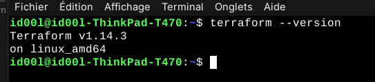

#### 2. Installer Ansible

Ansible est un outil d'automatisation informatique qui permet de gérer la configuration des systèmes, le déploiement d'applications et l'orchestration des tâches à travers plusieurs serveurs.

```bash
python3 -m pip install --user ansible
```

Vérification :

```bash
ansible --version
```
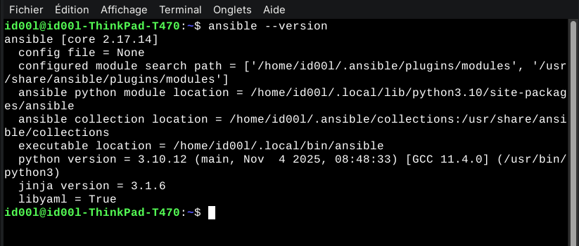

#### 3. Installer AWS CLI

AWS CLI (Command Line Interface) est un outil qui permet de gérer les services AWS depuis la ligne de commande.

```bash
curl "https://awscli.amazonaws.com/awscli-exe-linux-x86_64.zip" -o "awscliv2.zip"
unzip awscliv2.zip
sudo ./aws/install
```

Vérification :

```bash
aws --version
```
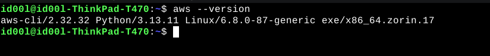

#### 4. Installer Git

Git est un système de contrôle de version distribué qui permet de suivre les modifications apportées aux fichiers et de collaborer avec d'autres développeurs sur des projets.

```bash
sudo apt install git -y
```

Vérification :

```bash
git --version
```

#### 5. Configurer AWS CLI
Avant d'utiliser AWS CLI, il est nécessaire de le configurer avec vos informations d'identification AWS.

aws configure = clé permanente sur la machine
aws sso login = connexion temporaire via navigateur

```bash
aws login
```

---

### Provisionning Infrastructue avec Terraform

### Objectifs

Dans cette partie, vous allez apprendre à :

- Initialiser un projet Terraform.
- Configurer le provider AWS pour permettre la gestion des ressources cloud.
- Créer un VPC, un subnet public et une Internet Gateway pour la connectivité réseau.
- Définir un Security Group autorisant les accès SSH (port 22) et HTTP (port 80).
- Déployer deux instances EC2 de type t3.micro.
- Générer et afficher les adresses IP publiques des instances créées.
- Vérifier la configuration avec `terraform plan`.
- Appliquer la configuration avec `terraform apply`.
- Tester la connexion SSH à l'une des instances.
- Nettoyer l’infrastructure avec `terraform destroy`.

#### 1. le fichier "main.tf" : Fichier principal de configuration Terraform

```hcl
terraform {
  required_version = ">= 1.0"
  
  required_providers {
    aws = {
      source  = "hashicorp/aws" # Source du provider AWS
      version = "~> 5.0"
    }
  }
}

provider "aws" {
  region = "eu-west-3"
  
  default_tags {
    tags = {
      Project     = "TechNova-Phase2"
      Environment = "dev"
      ManagedBy   = "Terraform"
    }
  }
}  
```
Il est nécessaire d'initialiser le projet Terraform avec la commande suivante :

```bash
terraform init
```
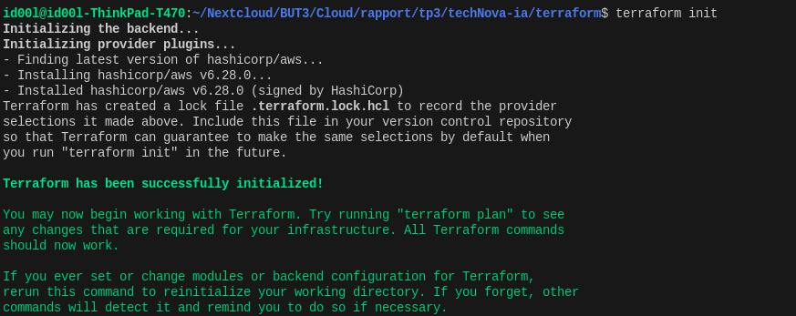

#### 2. Le fichier "variables.tf" : Définition des variables

Ici, nous définissons des variables pour le CIDR du VPC, le type d'instance EC2 et le nombre d'instances à créer.

```hcl
variable "vpc_cidr" {
  type        = string
  default     = "10.0.0.0/16"
  description = "CIDR block du VPC"
}

variable "instance_type" {
  type        = string
  default     = "t3.micro"
  description = "Type instance EC2"
}

variable "instance_count" {
  type        = number
  default     = 2
  description = "Nombre d'instances à créer"
  
  validation {
    condition     = var.instance_count > 0 && var.instance_count <= 5
    error_message = "Entre 1 et 5 instances."
  }
}
```

#### 3. Le fichier "terraform.tfvars" : Valeurs des variables

Ici, nous attribuons des valeurs spécifiques aux variables définies dans `variables.tf`.

```hcl
vpc_cidr       = "10.0.0.0/16"
instance_type  = "t3.micro"
instance_count = 2
EOF
```

#### 4. Le fichier "vpc.tf" : Configuration du VPC et des ressources réseau

Le fichier suivant crée un VPC, un subnet public, une Internet Gateway, une table de routage et associe la table de routage au subnet.

```hcl
# ==================== VPC ====================

resource "aws_vpc" "main" {
  cidr_block           = var.vpc_cidr
  enable_dns_hostnames = true
  enable_dns_support   = true

  tags = { Name = "vpc-technova" }
}

# ==================== SUBNET PUBLIC ====================

resource "aws_subnet" "public" {
  vpc_id                  = aws_vpc.main.id
  cidr_block              = "10.0.1.0/24"
  availability_zone       = "eu-west-3a"
  map_public_ip_on_launch = true

  tags = { Name = "subnet-public-technova" }
}

# ==================== INTERNET GATEWAY ====================

resource "aws_internet_gateway" "main" {
  vpc_id = aws_vpc.main.id

  tags = { Name = "igw-technova" }
}

# ==================== ROUTE TABLE ====================

resource "aws_route_table" "public" {
  vpc_id = aws_vpc.main.id

  route {
    cidr_block      = "0.0.0.0/0"
    gateway_id      = aws_internet_gateway.main.id
  }

  tags = { Name = "rt-public-technova" }

  depends_on = [aws_internet_gateway.main]
}

# ==================== ROUTE TABLE ASSOCIATION ====================

resource "aws_route_table_association" "public" {
  subnet_id      = aws_subnet.public.id
  route_table_id = aws_route_table.public.id
}
```

#### 5. Le fichier "security.tf" : Configuration du Security Group

Le fichier suivant définit un Security Group qui permet les accès SSH (port 22), HTTP (port 80) et HTTPS (port 443) depuis n'importe quelle adresse IP.

```hcl
# ==================== SECURITY GROUP ====================

resource "aws_security_group" "web" {
  name = "web-web-technova"
  description = "Security group pour serveurs web"
  vpc_id      = aws_vpc.main.id

  # ========== INBOUND ==========

  ingress {
    from_port   = 22
    to_port     = 22
    protocol    = "tcp"
    cidr_blocks = ["0.0.0.0/0"]
    description = "SSH access"
  }

  ingress {
    from_port   = 80
    to_port     = 80
    protocol    = "tcp"
    cidr_blocks = ["0.0.0.0/0"]
    description = "HTTP access"
  }

  ingress {
    from_port   = 443
    to_port     = 443
    protocol    = "tcp"
    cidr_blocks = ["0.0.0.0/0"]
    description = "HTTPS access"
  }

  # ========== OUTBOUND ==========

  egress {
    from_port   = 0
    to_port     = 0
    protocol    = "-1"
    cidr_blocks = ["0.0.0.0/0"]
    description = "Allow all outbound"
  }

  tags = { Name = "sg-web-technova" }
}

# ==================== SSH KEY PAIR ====================

resource "aws_key_pair" "deployer" {
  key_name   = "deployer-technova"
  public_key = file("/home/id00l/.ssh/id_rsa.pub")

  tags = { Name = "deployer-key" }
}
```

Afin de verifier la configuration du projet :

```bash
terraform validate
```
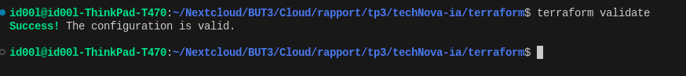

#### 6. Le fichier "instances.tf" : Configuration des instances EC2

Dans ce fichier, nous définissons la création de deux instances EC2 de type t3.micro, en utilisant l'AMI Ubuntu 22.04.

```hcl
# ==================== DATA : Trouver AMI Ubuntu ====================

data "aws_ami" "ubuntu" {
  most_recent = true
  owners      = ["099720109477"]  # Canonical

  filter {
    name   = "name"
    values = ["ubuntu/images/hvm-ssd/ubuntu-jammy-22.04-amd64-server-*"]
  }

  filter {
    name   = "virtualization-type"
    values = ["hvm"]
  }
}

# ==================== EC2 INSTANCES ====================

resource "aws_instance" "web" {
  count              = var.instance_count
  ami                = data.aws_ami.ubuntu.id
  instance_type      = var.instance_type
  key_name           = aws_key_pair.deployer.key_name
  subnet_id          = aws_subnet.public.id
  security_groups    = [aws_security_group.web.id]
  monitoring         = true

  root_block_device {
    volume_type           = "gp3"
    volume_size           = 20
    delete_on_termination = true
    encrypted             = true
  }

  tags = {
    Name = "web-technova-${count.index + 1}"
  }

  depends_on = [aws_internet_gateway.main]

  lifecycle {
    create_before_destroy = true
  }
}
```

#### 7. Le fichier "outputs.tf" : Affichage des adresses IP publiques

Ici, nous définissons des outputs pour afficher les adresses IP publiques des instances EC2 créées.

```hcl
# ==================== VPC OUTPUTS ====================

output "vpc_id" {
  description = "ID du VPC"
  value       = aws_vpc.main.id
}

output "subnet_id" {
  description = "ID du subnet public"
  value       = aws_subnet.public.id
}

# ==================== INSTANCE OUTPUTS ====================

output "instance_ids" {
  description = "IDs des instances EC2"
  value       = aws_instance.web[*].id
}

output "instance_ips_public" {
  description = "IPs publiques (SSH/HTTP)"
  value       = aws_instance.web[*].public_ip
}

output "instance_ips_private" {
  description = "IPs privées"
  value       = aws_instance.web[*].private_ip
}

# ==================== ANSIBLE OUTPUTS ====================

output "instance_ips" {
  description = "IPs publiques formatées pour Ansible"
  value = {
    for i, instance in aws_instance.web :
    instance.tags["Name"] => instance.public_ip
  }
}

# Inventaire Ansible ready-to-use
output "ansible_inventory" {
  description = "Inventaire Ansible (copy-paste)"
  value = "[webservers]\n${join("\n", [
    for i, instance in aws_instance.web :
    "${instance.tags["Name"]} ansible_host=${instance.public_ip} ansible_user=ubuntu"
  ])}\n\n[webservers:vars]\nansible_ssh_private_key_file=~/.ssh/id_rsa"
}

# ==================== SUMMARY ====================

output "deployment_summary" {
  description = "Résumé du déploiement"
  value = {
    vpc_cidr       = aws_vpc.main.cidr_block
    subnet_cidr    = aws_subnet.public.cidr_block
    instances_count = var.instance_count
    instance_type  = var.instance_type
  }
}
```

Après avoir configuré tous les fichiers nécessaires, vous pouvez vérifier la configuration avec :

On vérifie le plan d'exécution :

- CIDR du VPC & Subnet CIDR : 10.0.1.0/24 :
- Instance présente : 2

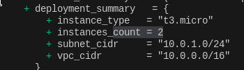

- Port 22 (SSH) ouvert
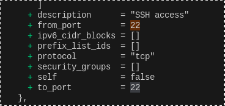

- Port 80 (HTTP) ouvert
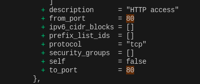

```bash
terraform apply plan
```

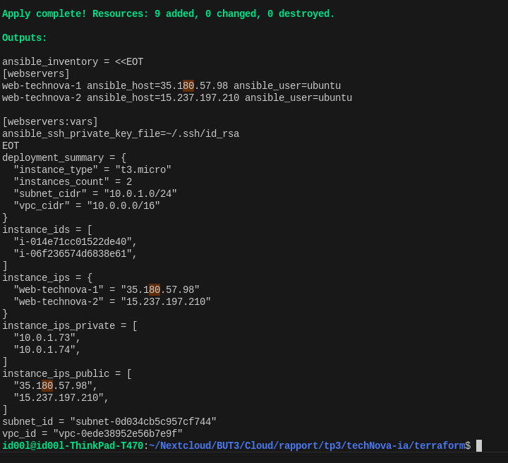


### Analyse de la sortie de `terraform apply`

Après l'exécution de la commande `terraform apply`, Terraform affiche un résumé de l'infrastructure créée et les valeurs des outputs définis dans le fichier `outputs.tf`.

- **Création des ressources**  
    ```
    Apply complete! Resources: 9 added, 0 changed, 0 destroyed.
    ```
    Cela indique que 9 ressources ont été créées (VPC, subnet, instances EC2, security group, etc.), aucune n'a été modifiée ou supprimée.

- **Inventaire Ansible généré automatiquement : fichier ./ansible/hosts.ini**  
    ```
    ansible_inventory = <<EOT
    [webservers]
    web-technova-1 ansible_host=35.180.57.98 ansible_user=ubuntu
    web-technova-2 ansible_host=15.237.197.210 ansible_user=ubuntu
    
    [webservers:vars]
    ansible_ssh_private_key_file=~/.ssh/id_rsa
    EOT
    ```
    Ce bloc fournit un inventaire prêt à l'emploi pour Ansible, listant les serveurs web avec leurs adresses IP publiques et l'utilisateur SSH à utiliser.

- **Résumé du déploiement**  
    ```
    deployment_summary = {
        "instance_type" = "t3.micro"
        "instances_count" = 2
        "subnet_cidr" = "10.0.1.0/24"
        "vpc_cidr" = "10.0.0.0/16"
    }
    ```
    Ce résumé rappelle les principaux paramètres du déploiement : type et nombre d'instances, CIDR du VPC et du subnet.

- **Identifiants et adresses des instances**  
    ```
    instance_ids = [
        "i-014e71cc01522de40",
        "i-06f236574d6838e61",
    ]
    instance_ips = {
        "web-technova-1" = "35.180.57.98"
        "web-technova-2" = "15.237.197.210"
    }
    instance_ips_private = [
        "10.0.1.73",
        "10.0.1.74",
    ]
    instance_ips_public = [
        "35.180.57.98",
        "15.237.197.210",
    ]
    ```
    - `instance_ids` : identifiants uniques AWS des instances EC2 créées.
    - `instance_ips` : correspondance entre le nom de l’instance et son IP publique.
    - `instance_ips_private` : adresses IP privées attribuées dans le subnet.
    - `instance_ips_public` : adresses IP publiques accessibles depuis Internet.

- **Identifiants du réseau**  
    ```
    subnet_id = "subnet-0d034cb5c957cf744"
    vpc_id = "vpc-0ede38952e56b7e9f"
    ```
    Ces valeurs correspondent aux identifiants AWS du subnet et du VPC créés.

Grâce à ces outputs, il est possible de :
- Se connecter en SSH aux instances via leur IP publique.
- Utiliser directement l’inventaire Ansible pour automatiser la configuration.
- Vérifier rapidement la topologie et les ressources déployées.


### Connexion SSH à une instance EC2

Pour se connecter en SSH à l'une des instances EC2 créées, utilisez la commande suivante en remplaçant `<IP_PUBLIQUE>` par l'adresse IP publique de l'instance (par exemple, `

```bash
ssh -i ~/.ssh/id_rsa -o StrictHostKeyChecking=no ubuntu@35.180.57.98 "whoami"
```
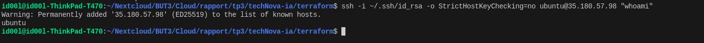

### Configuration avec Ansible

Dans cette seconde partie, nous allons utiliser Ansible pour automatiser la configuration des instances EC2 déployées avec Terraform. Les objectifs sont les suivants :

- Générer automatiquement un inventaire Ansible à partir des outputs Terraform.
- Vérifier la connectivité des instances via Ansible avec le module `ping`.
- Écrire un playbook Ansible pour installer et configurer Nginx sur les serveurs.
- Créer un template Jinja2 pour personnaliser la configuration de Nginx.
- Déployer une page HTML dynamique sur chaque instance.
- Utiliser des handlers Ansible pour redémarrer Nginx en cas de modification de configuration.
- Exécuter le playbook et valider le bon déroulement du déploiement.
- Accéder aux pages web déployées depuis un navigateur.
- Vérifier la disponibilité des serveurs avec des health checks HTTP.

#### Vérification de l'inventaire Ansible

Après avoir appliqué la configuration Terraform, un inventaire Ansible est généré, je l'ai copié dans le fichier `./ansible/hosts.ini` pour une utilisation facile avec Ansible.

```bash
wc -l hosts.ini
```
```bash
id00l@id00l-ThinkPad-T470:~/Nextcloud/BUT3/Cloud/rapport/tp3/techNova-ia/ansible$ wc -l hosts.ini
5 hosts.ini
```

Nous pouvons tester la connectivité des instances EC2 avec Ansible en utilisant le module `ping` :

```bash
ansible -i hosts.ini all -m ping
```
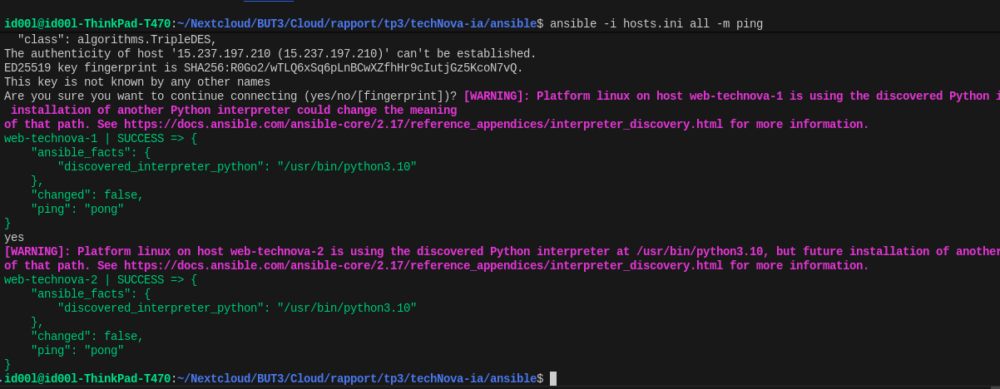

On voit bien un retour "pong" de chaque instance, ce qui confirme que la connexion SSH fonctionne correctement via Ansible.

#### Playbook Ansible – Résumé des tâches

Voici les principales tâches du playbook Ansible et leur fonction :

- **Met à jour le cache APT** : Assure que la liste des paquets est à jour.
- **Installe Nginx** : Déploie le serveur web Nginx sur les instances.
- **Installe curl** : Ajoute l’outil curl pour les vérifications HTTP.
- **Crée le dossier de l’application** : Prépare le répertoire `/var/www/devcloud` pour héberger la page web.
- **Déploie la page HTML** : Copie un fichier `index.html` personnalisé sur chaque serveur.
- **Déploie la configuration Nginx** : Applique un template de configuration pour servir la page.
- **Active le site devcloud** : Crée un lien symbolique pour activer la configuration Nginx.
- **Désactive le site par défaut** : Supprime la configuration Nginx par défaut.
- **Démarre et active Nginx** : S’assure que Nginx tourne et démarre au boot.
- **Attend que Nginx soit prêt** : Patiente jusqu’à ce que le service soit disponible.
- **Teste la réponse HTTP** : Vérifie que la page web est accessible.
- **Affiche un résumé** : Donne un retour sur le succès du déploiement.

Des handlers redémarrent Nginx si la configuration change.

On va vérifier la syntaxe du playbook avec la commande :

```bash
ansible-playbook -i hosts.ini playbook.yml --syntax-check
```

#### Création du template Jinja2
Jinja2 est un moteur de template pour Python, utilisé par Ansible pour générer des fichiers de configuration dynamiques. Voici un exemple de template Jinja2 pour la configuration Nginx :

Dans notre playbook, nous utilisons un template Jinja2 pour générer le fichier de configuration Nginx. Voici à quoi ressemble ce template (`nginx.conf.j2`) :

```nginx
# Nginx configuration for TechNova
# Generated by Ansible

server {
    listen {{ nginx_port }} default_server;
    listen [::]:{{ nginx_port }} default_server;

    server_name _;

    # Compression
    gzip on;
    gzip_types text/plain text/css text/javascript application/json;
    gzip_vary on;

    # Security headers
    add_header X-Frame-Options "SAMEORIGIN" always;
    add_header X-Content-Type-Options "nosniff" always;
    add_header X-XSS-Protection "1; mode=block" always;

    # Root directory
    root {{ app_dir }};
    index index.html;

    # Main location
    location / {
        try_files $uri $uri/ =404;
    }

    # Health check endpoint
    location /health {
        access_log off;
        return 200 "healthy\n";
        add_header Content-Type text/plain;
    }

    # Deny hidden files
    location ~ /\. {
        deny all;
        access_log off;
        log_not_found off;
    }

    # Logging
    access_log /var/log/nginx/devcloud_access.log combined buffer=32k;
    error_log /var/log/nginx/devcloud_error.log warn;
}
```

On va ensuite déployer ce template via le playbook Ansible pour configurer Nginx sur les serveurs cibles. Mais avant cela on va executer en mode dry-run pour vérifier que tout est correct :

```bash
ansible-playbook -i hosts.ini playbook.yml --check
```
On voit une erreur normale car en mode dry-run on n'execute pas réellement les tâches d'installation etc.

```bash

TASK [Enable devcloud site] ***********************************************************************************************************************************************************************
changed: [web-technova-2]
changed: [web-technova-1]

TASK [Disable default site] ***********************************************************************************************************************************************************************
ok: [web-technova-2]
ok: [web-technova-1]

TASK [Start and enable Nginx] *********************************************************************************************************************************************************************
fatal: [web-technova-2]: FAILED! => {"changed": false, "msg": "Could not find the requested service nginx: host"}
fatal: [web-technova-1]: FAILED! => {"changed": false, "msg": "Could not find the requested service nginx: host"}

PLAY RECAP ****************************************************************************************************************************************************************************************
web-technova-1             : ok=10   changed=6    unreachable=0    failed=1    skipped=0    rescued=0    ignored=0   
web-technova-2             : ok=10   changed=6    unreachable=0    failed=1    skipped=0    rescued=0    ignored=0   

id00l@id00l-ThinkPad-T470:~/Nextcloud/BUT3/Cloud/rapport/tp3/techNova-ia/ansible$ 
```

A prés vérification, on peut exécuter le playbook réellement :

```bash
ansible-playbook -i hosts.ini playbook.yml -v
```
Cependant après exécution, on constate que certaines tâches ont échoué, notamment la vérification de l'accès HTTP à Nginx. En effet un défaut de configuration ansible empêche Nginx de servir correectement le fichier HTML.

Modification du playbook pour corriger l'erreur et réexécution :

Avant de la modification :
```bash
url: "http://localhost:{{ nginx_port }}/index.html"
```
Après modification :
```bash
url: "http://localhost:{{ nginx_port }}/"
```

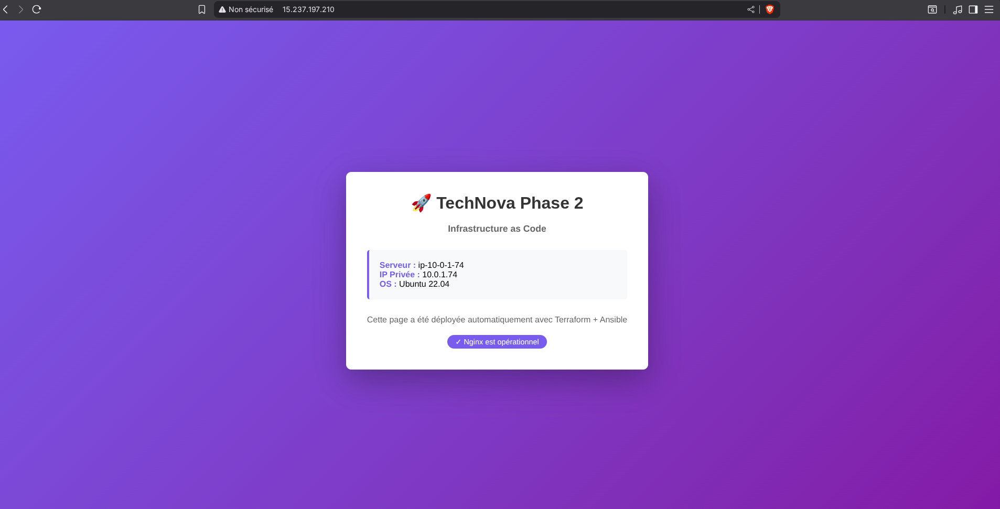

Les logs d'executions sont dans le fichier `deployment_log.txt`.